[TOC]

# 虎彩信息中心创新研发部新人指引-前端部分
## web前端开发规范

### CSS书写规范
* 待完善
    > 待完善

### javaScript书写规范

#### 命名规范
* 常量名
    >全部大写并单词间用下划线分隔<br /> 
    >如：CSS_BTN_CLOSE、TXT_LOADING
* 对象属性或者方法名
    >小驼峰式<br /> 
    >如：init、bindEvent、updatePosition<br />
    >示例：<br/>
``` 
    Dialog.prototype = {
        init: function () {},
        bindEvent: function () {},
        updatePosition: function () {}
        …
    }; 
```
* 类名（构造器）
    >小驼峰式但首字母大写 <br/>
    >如：Current、DefaultConfig
* 函数名
    >小驼峰式 <br/>
    >如：current()、defaultConfig()
* 变量名
    >小驼峰式 <br/>
    >如：current、defaultConfig

#### 代码格式
* "()"前后需要跟空格
* "="前后需要跟空格
* ","后面需要跟空格
* JSON对象需格式化对象参数
* if、while、for、do语句的执行体用"{}"括起来
    >"{}"格式如下。
```
if (a==1) {
    //代码
};
```
* 避免额外的逗号。
    >var arr = [1,2,3,];
* for-in循环体中必须用hasOwnProperty方法检查成员是否为自身成员，避免来自原型链上的污染。
* 使用严格的条件判断符。用===代替==，用!==代替!=，避免掉入==造成的陷阱。
    >在条件判断时，这样的一些值表示false。<br/>
    >null, undefined与null相等, 字符串'', 数字0, NaN
* 在==时，则会有一些让人难以理解的陷阱。
    ```
    (function () {
        var undefined;
        undefined == null; // true
        1 == true; //true
        2 == true; // false
        0 == false; // true
        0 == ''; // true
        NaN == NaN;// false
        [] == false; // true
        [] == ![]; // true
    })();
    ```

* 对于不同类型的 == 判断，有这样一些规则，顺序自上而下：
    >undefined与null相等<br/>
    >一个是number一个是string时，会尝试将string转换为number<br/>
    >尝试将boolean转换为number<br/>
    >尝试将Object转换成number或string
* 而这些取决于另外一个对比量，即值的类型，所以对于0、空字符串的判断，建议使用===
* 以下的类型对象不使用new 构造
    ```
    new Number
    new String
    new Boolean
    new Object //用{}代替
    new Array //用[]代替
    ```
* 引用对象成员用obj.prop代替obj["prop"]，除非属性名是变量。
* 从number到string的转换。
    ```
    /** 推荐写法*/
    var a = 1;
    typeof(a); //"number"
    console.log(a); //1
    var aa=a+'';
    typeof(aa); //"string"
    console.log(aa); //'1'
    /** 不推荐写法*/
    new String(a)或a.toString()
    ```
* 从string到number的转换，使用parseInt，必须显式指定第二个参数的进制。
    ``` 
    /** 推荐写法*/
    var a = '1';
    var aa = parseInt(a,10);
    typeof(a); //"string"
    console.log(a); //'1'
    typeof(aa); //"number"
    console.log(aa); //1
    ```
* 从float到integer的转换。
    ```
    /** 推荐写法*/
    Math.floor/Math.round/Math.ceil
    /** 不推荐写法*/
    parseInt
    ```
* 字符串拼接应使用数组保存字符串片段，使用时调用join方法。避免使用+或+=的方式拼接较长的字符串，每个字符串都会使用一个小的内存片段，过多的内存片段会影响性能。
    ```
    /**推荐的拼接方式array的push、join*/
    var str=[],
        list=['测试A','测试B'];
    for (var i=0 , len=list.length; i < len; i++) {
        str.push( '<div>'+ list[i] + '</div>');
    };
    console.log(str.join('')); //<div>测试A</div><div>测试B</div>
    /** 不推荐的拼接方式+=*/
    var str = '',
        list=['测试A','测试B'];
    for (var i = 0, len = list.length; i< len; i++) {
        str+='<div>' + list[i] + '</div>';
    };
    console.log(str); //<div>测试A</div><div>测试B</div>
    ```
* 尽量避免使用存在兼容性及消耗资源的方法或属性。
    >不要使用with，void，evil，eval_r，innerText


## VueJS前端开发环境
### Node.js安装及环境配置
* 安装环境
    > * 本机系统：Windows 7（64位）<br/>
    > * Node.js：v8.11.3LTS（64位）
* 3.3.2.1.2安装Node.js步骤
    > * 下载对应你系统的Node.js版本:https://nodejs.org/en/download/<br/>
    > * 选安装目录进行安装<br/>
    > * 测试
* 前期准备
    > * Node.js简介<br/>
    简单的说 Node.js 就是运行在服务端的 JavaScript。Node.js 是一个基于 Chrome V8 引擎的 JavaScript 运行环境。Node.js 使用了一个事件驱动、非阻塞式 I/O 的模型，使其轻量又高效。Node.js 的包管理器 npm，是全球最大的开源库生态系统。
    > * 下载Node.js<br/>
    打开官网下载链接:https://nodejs.org/en/download/ 我这里下载的是node-v8.11.3-x64.msi,如下图：
    >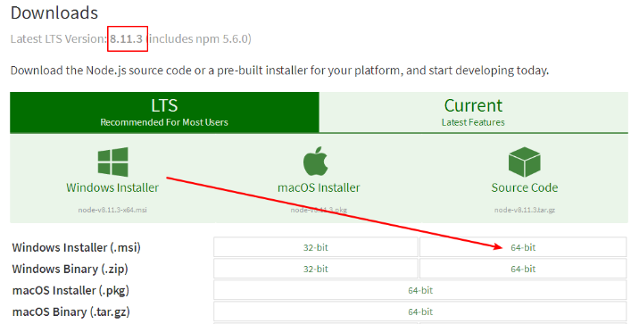
* 开始安装
    >下载完成后，双击“node-v8.11.3-x64.msi”，开始安装Node.js点击【Next】按钮。<br/>
    >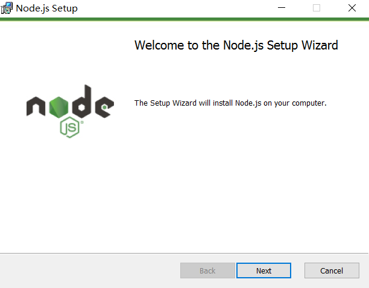<br/>
    ><br/>
    >勾选复选框，点击【Next】按钮<br/>
    ><br/>
    >点击【Next】按钮<br/>
    >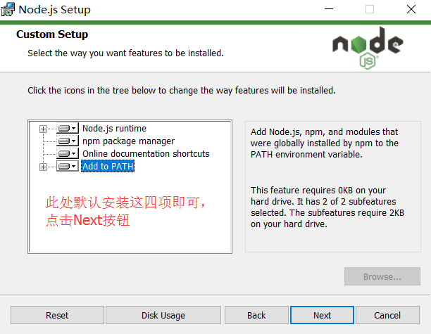<br/>
    >安装完后点击【Finish】按钮完成安装<br/>
    ><br/>
    >至此Node.js已经安装完成，可以先进行下简单的测试安装是否成功了， 在键盘按下【win+R】键，输入cmd，然后回车，打开cmd窗口。<br/>
    >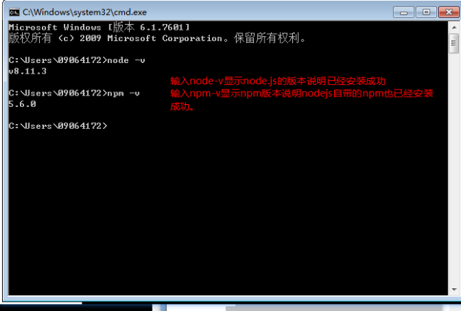<br/>
    >安装完后的目录如下图所示：<br/>
    >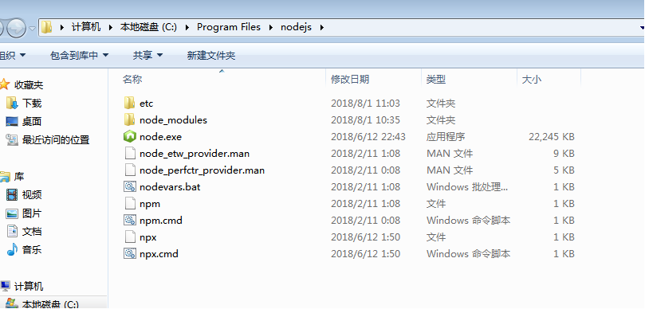<br/>

### npm镜像切换工具nrm使用
>npm全称Node Package Manager，是node.js的模块依赖管理工具。由于npm的源在国外，所以国内用户使用起来各种不方便。在中国访问外国的服务器非常慢~~ npm install xxx //浪费时间等等等~~，可能会成功，可能会失败（失败后再试，总之就是慢）<br/>
* 此时推荐使用 npm镜像，优先推荐 taobao
* 查看当前镜像下载路径：
    > 命令行输入：npm config get registry <br/>
    > 显示：https://registry.npmjs.org/	此时所有安装工具都是在国外的npm网站下载
* 以下提供两种手段：二选一即可 完成下载镜像路径的切换
    - 手段A:
        >> 1.临时使用	npm install xxxxxxx --registry https://registry.npm.taobao.org<br/>
        >> 2.持久使用	npm config set registry https://registry.npm.taobao.org<br/>
        >> 3.检验设置是否成功：npm config get registry	成功显示：https://registry.npm.taobao.org/<br/>
    - 手段B：
        >> 打开cmd命令行输入 npm install nrm -g	//一分钟时间，安装完成<br/>
        >> 查看有什么镜像可用，cmd命令行输入 nrm ls	结果如下<br/>
        >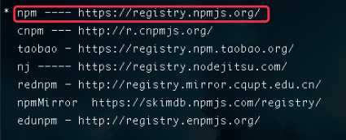<br/>
        >> nrm test	//测试速度 功能鸡肋可以略过<br/>
        >> nrm use taobao	//使用淘宝镜像 回车<br/>
        >> 再次输入 nrm ls	//此时已经显示<br/>
        <br/>
        >> 检验设置是否成功：<br/>
        >> npm config get registry	成功显示：https://registry.npm.taobao.org/<br/>
* 最终温馨提示
    - 切换镜像之前，在国外npm网站下载，命令行输入	：npm install xxxxxxxxx
    - A B手段二选一，设置好后，在国内taobao下载，命令行输入 ：npm install xxxxxxxxx
        
### vue-cli（vue脚手架）教程
* 1,安装vue-cli
    + 使用npm（需要安装node环境）全局安装webpack，打开命令行工具输入：npm install webpack -g或者（npm install -g webpack），安装完成之后输入 webpack -v，如下图，如果出现相应的版本号，则说明安装成功。
        > 注意：webpack 4.X 开始，需要安装 webpack-cli 依赖 ,所以使用这条命令  npm install webpack webpack-cli -g

    + 全局安装vue-cli，在cmd中输入命令:
        > npm install --global vue-cli

        <br/>
    + 安装成功：<br/>
        <br/>
    
    + 安装完成之后输入 vue -V（注意这里是大写的“V”），如下图，如果出现相应的版本号，则说明安装成功。<br/>
    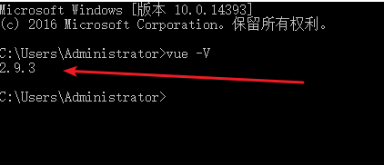<br/>
* 2,用vue-cli来构建项目
    + 我首先在D盘新建一个文件夹（vue_test）作为项目存放地，然后使用命令行cd进入到项目目录输入：<br/>
    ``` vue init webpack vue_test ```
    + vue_test是自定义的项目名称，命令执行之后，会在当前目录生成一个以该名称命名的项目文件夹。<br/>
        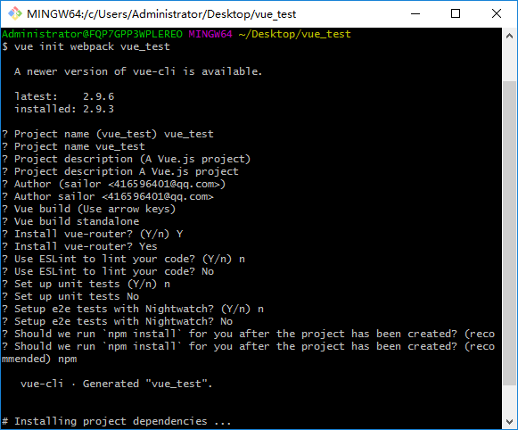<br/>
        > 输入命令后，会跳出几个选项让你回答：
        > - Project name (baoge)： -----项目名称，直接回车，按照括号中默认名字（注意这里的名字不能有大写字母，如果有会报错Sorry, name can no longer contain capital letters），阮一峰老师博客[为什么文件名要小写](http://www.ruanyifeng.com/blog/2017/02/filename-should-be-lowercase.html) ，可以参考一下。
        > - Project description (A Vue.js project)： ----项目描述，也可直接点击回车，使用默认名字
        > - Author ()： ----作者，输入你的大名
        > - Runtime + Compiler: recommended for most users 运行加编译，既然已经说了推荐，就选它了
        > - Install vue-router? (Y/n) 是否安装vue-router，这是官方的路由，大多数情况下都使用，这里就输入“y”后回车即可。
        > - Use ESLint to lint your code? (Y/n) 是否使用ESLint管理代码，ESLint是个代码风格管理工具，是用来统一代码风格的，一般项目中都会使用。
        > - Setup unit tests with Karma + Mocha? (Y/n) 是否安装单元测试，我选择不安装n回车
        > - Setup e2e tests with Nightwatch(Y/n)? 是否安装e2e测试 ，我选择不安装n回车
    + 回答完毕后上图就开始构建项目了。
        - 配置完成后，可以看到目录下多出了一个项目文件夹baoge，然后cd进入这个文件夹：
            > + 安装依赖： ``` npm install ```
            >> ( 如果安装速度太慢。可以安装淘宝镜像，打开命令行工具，输入：npm install -g cnpm --registry=https://registry.npm.taobao.org然后使用cnpm来安装 或者使用nrm工具切换npm镜像)<br/>
            > + npm install ：安装所有的模块，如果是安装具体的哪个个模块，在install 后面输入模块的名字即可。而只输入install就会按照项目的根目录下的package.json文件中依赖的模块安装（这个文件里面是不允许有任何注释的），每个使用npm管理的项目都有这个文件，是npm操作的入口文件。因为是初始项目，还没有任何模块，所以我用npm install 安装所有的模块。安装完成后，目录中会多出来一个node_modules文件夹，这里放的就是所有依赖的模块。<br/>

        - 然后现在，baoge文件夹里的目录是这样的：<br/>
        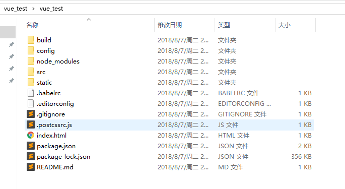<br/>
        - 解释下每个文件夹代表的意思(仔细看一下这张图）：<br/>
        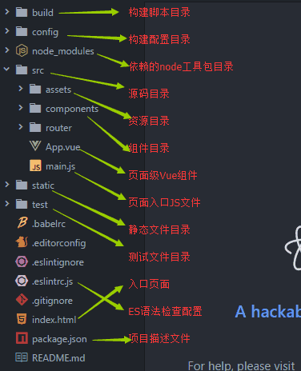<br/>
* 3,用vue-cli来构建项目<br/>
    ``` npm run dev ```
    > 之后出现 ``` I  Your application is running here: http://localhost:8080 ```
    > 则表示编译成功<br/>
    > 浏览器打开``` http://localhost:8080 ``` 即可<br/>
    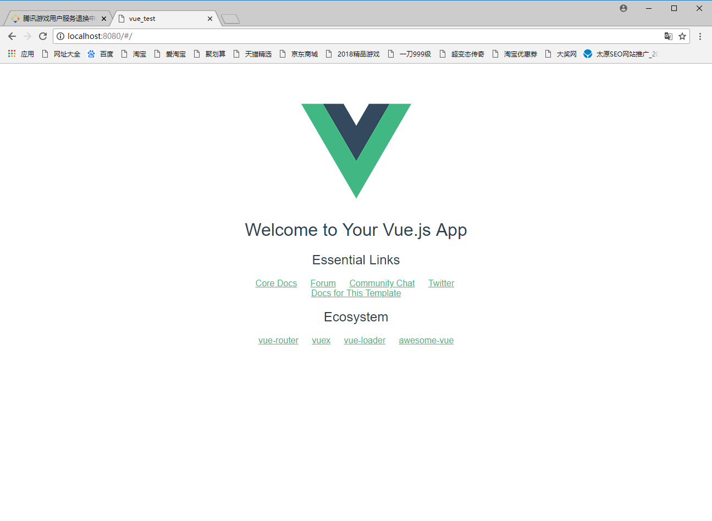<br/>
* 4,打包上线
    > 注意，自己的项目文件都需要放到 src 文件夹下。在项目开发完成之后，可以输入 npm run build 来进行打包工作。<br/>
    ``` npm run build ```<br/>

    ``` 
        1.npm 开启了npm run dev以后怎么退出或关闭？
        ctrl+c
        2.--save-dev
        自动把模块和版本号添加到模块配置文件package.json中的依赖里devdependencies部分
        3. --save-dev 与 --save 的区别
        --save     安装包信息将加入到dependencies（生产阶段的依赖）
        --save-dev 安装包信息将加入到devDependencies（开发阶段的依赖），所以开发阶段一般使用它
    ```
    > 打包完成后，会生成 dist 文件夹，如果已经修改了文件路径，可以直接打开本地文件查看。项目上线时，只需要将 dist 文件夹放到服务器就行了。<br/>


## VueJS前端教程

### vueJS快速入门

> Vue.js是当下很火的一个JavaScript MVVM库，它是以数据驱动和组件化的思想构建的。相比于Angular.js，Vue.js提供了更加简洁、更易于理解的API，使得我们能够快速地上手并使用Vue.js。
* MVVM模式

    下图不仅概括了MVVM模式（Model-View-ViewModel），还描述了在Vue.js中ViewModel是如何和View以及Model进行交互的。
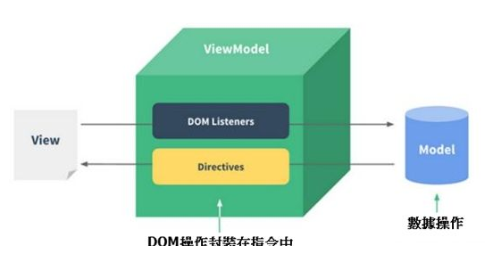<br/>
    ViewModel是Vue.js的核心，它是一个Vue实例。Vue实例是作用于某一个HTML元素上的，这个元素可以是HTML的body元素，也可以是指定了id的某个元素。

    当创建了ViewModel后，双向绑定是如何达成的呢？

    首先，我们将上图中的DOM Listeners和Data Bindings看作两个工具，它们是实现双向绑定的关键。
    从View侧看，ViewModel中的DOM Listeners工具会帮我们监测页面上DOM元素的变化，如果有变化，则更改Model中的数据；
    从Model侧看，当我们更新Model中的数据时，Data Bindings工具会帮我们更新页面中的DOM元素。

* Hello World示例

    了解一门语言，或者学习一门新技术，编写Hello World示例是我们的必经之路。这段代码在画面上输出"Hello World!"。
    ```
        <!DOCTYPE html>
    <html>
        <head>
            <meta charset="UTF-8">
            <title></title>
        </head>

        <body>
            <!--这是我们的View-->
            <div id="app">
                {{ message }}
            </div>
        </body>
        <script src="js/vue.js"></script>
        <script>
            // 这是我们的Model
            var exampleData = {
                message: 'Hello World!'
            }

            // 创建一个 Vue 实例或 "ViewModel"
            // 它连接 View 与 Model
            new Vue({
                el: '#app',
                data: exampleData
            })
        </script>
    </html>
    ```

    + 使用Vue的过程就是定义MVVM各个组成部分的过程的过程。
        - 定义View(html代码)
        - 定义Model(页面数据部分)
        - 创建一个Vue实例或"ViewModel",它用于连接View和Model
    
    + 在创建Vue实例时，需要传入一个选项对象，选项对象可以包含数据(data)、挂载元素(el)、方法(methods)、[生命周期钩子](https://cn.vuejs.org/v2/guide/instance.html#实例生命周期钩子)等等。

    + 在这个示例中，选项对象的el属性指向View，el: '#app'表示该Vue实例将挂载到```<div id="app">...</div>```这个元素；data属性指向Model，data: exampleData表示我们的Model是exampleData对象。<br/>
    Vue.js有多种数据绑定的语法，最基础的形式是文本插值，使用一对大括号语法，在运行时{{ message }}会被数据对象的message属性替换，所以页面上会输出"Hello World!"。

* 双向绑定示例 
    + MVVM模式本身是实现了双向绑定的，在Vue.js中可以使用v-model指令在表单元素上创建双向数据绑定。
    ```
    <!--这是我们的View-->
    <div id="app">
        <p>{{ message }}</p>
        <input type="text" v-model="message"/>
    </div>
    ```
    + 将message绑定到文本框，当更改文本框的值时，```<p>{{ message }}</p>``` 中的内容也会被更新。

    <br/>

    + 反过来，如果改变message的值，文本框的值也会被更新，我们可以在Chrome控制台进行尝试。

    <br/>

    + Vue实例的data属性指向exampleData，它是一个引用类型，改变了exampleData对象的属性，同时也会影响Vue实例的data属性。

* Vue.js的常用指令
    > 上面用到的v-model是Vue.js常用的一个指令，那么指令是什么呢？

    > Vue.js的指令是以v-开头的，它们作用于HTML元素，指令提供了一些特殊的特性，将指令绑定在元素上时，指令会为绑定的目标元素添加一些特殊的行为，我们可以将指令看作特殊的HTML特性（attribute）。

    > Vue.js提供了一些常用的内置指令，接下来我们将介绍以下几个内置指令：
    ```
        v-if指令
        v-show指令
        v-else指令
        v-for指令
        v-bind指令
        v-on指令
    ```
    > Vue.js具有良好的扩展性，我们也可以开发一些自定义的指令，后面的文章会介绍自定义指令。

    + v-if指令

        v-if是条件渲染指令，它根据表达式的真假来删除和插入元素，它的基本语法如下：
        v-if="expression"

        expression是一个返回bool值的表达式，表达式可以是一个bool属性，也可以是一个返回bool的运算式。例如：

        ```
        <!DOCTYPE html>
        <html>
            <head>
                <meta charset="UTF-8">
                <title></title>
            </head>
            <body>
                <div id="app">
                    <h1>Hello, Vue.js!</h1>
                    <h1 v-if="yes">Yes!</h1>
                    <h1 v-if="no">No!</h1>
                    <h1 v-if="age >= 25">Age: {{ age }}</h1>
                    <h1 v-if="name.indexOf('jack') >= 0">Name: {{ name }}</h1>
                </div>
            </body>
            <script src="js/vue.js"></script>
            <script>
                
                var vm = new Vue({
                    el: '#app',
                    data: {
                        yes: true,
                        no: false,
                        age: 28,
                        name: 'keepfool'
                    }
                })
            </script>
        </html>
        ```
        > 注意：yes, no, age, name这4个变量都来源于Vue实例选项对象的data属性。

        <br/>

        > 这段代码使用了4个表达式：
            > - 数据的yes属性为true，所以"Yes!"会被输出；
            > - 数据的no属性为false，所以"No!"不会被输出；
            > - 运算式age >= 25返回true，所以"Age: 28"会被输出；
            > - 运算式name.indexOf('jack') >= 0返回false，所以"Name: keepfool"不会被输出。

        > 注意：v-if指令是根据条件表达式的值来执行元素的插入或者删除行为。
        - 这一点可以从渲染的HTML源代码看出来，上面只渲染了3个```<h1>```元素，v-if值为false的```<h1>```元素没有渲染到HTML。
        
        <br/>

        > 为了再次验证这一点，可以在Chrome控制台更改age属性，使得表达式age >= 25的值为false，可以看到```<h1>Age: 28</h1>```元素被删除了

        <br/>

        > age是定义在选项对象的data属性中的，为什么Vue实例可以直接访问它呢？这是因为每个Vue实例都会代理其选项对象里的data属性。
    + v-show指令
        - v-show也是条件渲染指令，和v-if指令不同的是，使用v-show指令的元素始终会被渲染到HTML，它只是简单地为元素设置CSS的style属性。
        ```
        <!DOCTYPE html>
        <html>
            <head>
                <meta charset="UTF-8">
                <title></title>
            </head>
            <body>
                <div id="app">
                    <h1>Hello, Vue.js!</h1>
                    <h1 v-show="yes">Yes!</h1>
                    <h1 v-show="no">No!</h1>
                    <h1 v-show="age >= 25">Age: {{ age }}</h1>
                    <h1 v-show="name.indexOf('jack') >= 0">Name: {{ name }}</h1>
                </div>
            </body>
            <script src="js/vue.js"></script>
            <script>
                
                var vm = new Vue({
                    el: '#app',
                    data: {
                        yes: true,
                        no: false,
                        age: 28,
                        name: 'keepfool'
                    }
                })
            </script>
        </html>
        ```

        <br/>

        + 在Chrome控制台更改age属性，使得表达式age >= 25的值为false，可以看到```<h1>Age: 24</h1>```元素被设置了style="display:none"样式。

        <br/>

    + v-else指令
        - 可以用v-else指令为v-if或v-show添加一个“else块”。v-else元素必须立即跟在v-if或v-show元素的后面——否则它不能被识别。
        ```
            <!DOCTYPE html>
            <html>

                <head>
                    <meta charset="UTF-8">
                    <title></title>
                </head>
                <body>
                    <div id="app">
                        <h1 v-if="age >= 25">Age: {{ age }}</h1>
                        <h1 v-else>Name: {{ name }}</h1>
                        <h1>---------------------分割线---------------------</h1>
                        <h1 v-show="name.indexOf('keep') >= 0">Name: {{ name }}</h1>
                        <h1 v-else>Sex: {{ sex }}</h1>
                    </div>
                </body>
                <script src="js/vue.js"></script>
                <script>
                    var vm = new Vue({
                        el: '#app',
                        data: {
                            age: 28,
                            name: 'keepfool',
                            sex: 'Male'
                        }
                    })
                </script>
            </html>
        ```
        - v-else元素是否渲染在HTML中，取决于前面使用的是v-if还是v-show指令。<br/>
            这段代码中v-if为true，后面的v-else不会渲染到HTML；v-show为tue，但是后面的v-else仍然渲染到HTML了。

        <br/>
        
    + v-for指令
        - v-for指令基于一个数组渲染一个列表，它和JavaScript的遍历语法相似：```v-for="item in items"```
            > items是一个数组，item是当前被遍历的数组元素。
        ```
        <!DOCTYPE html>
        <html>

            <head>
                <meta charset="UTF-8">
                <title></title>
                <link rel="stylesheet" href="styles/demo.css" />
            </head>

            <body>
                <div id="app">
                    <table>
                        <thead>
                            <tr>
                                <th>Name</th>
                                <th>Age</th>
                                <th>Sex</th>
                            </tr>
                        </thead>
                        <tbody>
                            <tr v-for="person in people">
                                <td>{{ person.name  }}</td>
                                <td>{{ person.age  }}</td>
                                <td>{{ person.sex  }}</td>
                            </tr>
                        </tbody>
                    </table>
                </div>
            </body>
            <script src="js/vue.js"></script>
            <script>
                var vm = new Vue({
                    el: '#app',
                    data: {
                        people: [{
                            name: 'Jack',
                            age: 30,
                            sex: 'Male'
                        }, {
                            name: 'Bill',
                            age: 26,
                            sex: 'Male'
                        }, {
                            name: 'Tracy',
                            age: 22,
                            sex: 'Female'
                        }, {
                            name: 'Chris',
                            age: 36,
                            sex: 'Male'
                        }]
                    }
                })
            </script>
        </html>
        ```
        - 我们在选项对象的data属性中定义了一个people数组，然后在#app元素内使用v-for遍历people数组，输出每个person对象的姓名、年龄和性别。

        <br/>

    + v-bind指令
        - v-bind指令可以在其名称后面带一个参数，中间放一个冒号隔开，这个参数通常是HTML元素的特性（attribute），例如：```v-bind:argument="expression"```
            > 下面这段代码构建了一个简单的分页条，v-bind指令作用于元素的class特性上。这个指令包含一个表达式，表达式的含义是：高亮当前页。
            ```
            <!DOCTYPE html>
            <html>
                <head>
                    <meta charset="UTF-8">
                    <title></title>
                    <link rel="stylesheet" href="styles/demo.css" />
                </head>
                <body>
                    <div id="app">
                        <ul class="pagination">
                            <li v-for="n in pageCount">
                                <a href="javascripit:void(0)" v-bind:class="activeNumber === n + 1 ? 'active' : ''">{{ n + 1 }}</a>
                            </li>
                        </ul>
                    </div>
                </body>
                <script src="js/vue.js"></script>
                <script>
                    var vm = new Vue({
                        el: '#app',
                        data: {
                            activeNumber: 1,
                            pageCount: 10
                        }
                    })
                </script>
            </html>
            ```
            > 注意v-for="n in pageCount"这行代码，pageCount是一个整数，遍历时n从0开始，然后遍历到pageCount –1结束。

            <br/>

    + v-on指令
        - v-on指令用于给监听DOM事件，它的用语法和v-bind是类似的，例如监听```<a>```元素的点击事件：```<a v-on:click="doSomething">```
        - 有两种形式调用方法：绑定一个方法（让事件指向方法的引用），或者使用内联语句。Greet按钮将它的单击事件直接绑定到greet()方法，而Hi按钮则是调用say()方法。

        ```
        <!DOCTYPE html>
        <html>
            <head>
                <meta charset="UTF-8">
                <title></title>
            </head>
            <body>
                <div id="app">
                    <p><input type="text" v-model="message"></p>
                    <p>
                        <!--click事件直接绑定一个方法-->
                        <button v-on:click="greet">Greet</button>
                    </p>
                    <p>
                        <!--click事件使用内联语句-->
                        <button v-on:click="say('Hi')">Hi</button>
                    </p>
                </div>
            </body>
            <script src="js/vue.js"></script>
            <script>
                var vm = new Vue({
                    el: '#app',
                    data: {
                        message: 'Hello, Vue.js!'
                    },
                    // 在 `methods` 对象中定义方法
                    methods: {
                        greet: function() {
                            // // 方法内 `this` 指向 vm
                            alert(this.message)
                        },
                        say: function(msg) {
                            alert(msg)
                        }
                    }
                })
            </script>
        </html>
        ```

        <br/>

    + v-bind和v-on的缩写
        > Vue.js为最常用的两个指令v-bind和v-on提供了缩写方式。v-bind指令可以缩写为一个冒号，v-on指令可以缩写为@符号。
        ```
        <!--完整语法-->
        <a href="javascripit:void(0)" v-bind:class="activeNumber === n + 1 ? 'active' : ''">{{ n + 1 }}</a>
        <!--缩写语法-->
        <a href="javascripit:void(0)" :class="activeNumber=== n + 1 ? 'active' : ''">{{ n + 1 }}</a>

        <!--完整语法-->
        <button v-on:click="greet">Greet</button>
        <!--缩写语法-->
        <button @click="greet">Greet</button>
        ```

    + 综合示例
        > 现在我们已经介绍了一些Vue.js的基础知识了，结合以上知识我们可以来做个小Demo。
        ```
        <!DOCTYPE html>
        <html>

            <head>
                <meta charset="UTF-8">
                <title></title>
                <link rel="stylesheet" href="styles/demo.css" />
            </head>

            <body>
                <div id="app">

                    <fieldset>
                        <legend>
                            Create New Person
                        </legend>
                        <div class="form-group">
                            <label>Name:</label>
                            <input type="text" v-model="newPerson.name"/>
                        </div>
                        <div class="form-group">
                            <label>Age:</label>
                            <input type="text" v-model="newPerson.age"/>
                        </div>
                        <div class="form-group">
                            <label>Sex:</label>
                            <select v-model="newPerson.sex">
                            <option value="Male">Male</option>
                            <option value="Female">Female</option>
                        </select>
                        </div>
                        <div class="form-group">
                            <label></label>
                            <button @click="createPerson">Create</button>
                        </div>
                </fieldset>
                <table>
                    <thead>
                        <tr>
                            <th>Name</th>
                            <th>Age</th>
                            <th>Sex</th>
                            <th>Delete</th>
                        </tr>
                    </thead>
                    <tbody>
                        <tr v-for="person in people">
                            <td>{{ person.name }}</td>
                            <td>{{ person.age }}</td>
                            <td>{{ person.sex }}</td>
                            <td :class="'text-center'"><button @click="deletePerson($index)">Delete</button></td>
                        </tr>
                    </tbody>
                </table>
                </div>
            </body>
            <script src="js/vue.js"></script>
            <script>
                var vm = new Vue({
                    el: '#app',
                    data: {
                        newPerson: {
                            name: '',
                            age: 0,
                            sex: 'Male'
                        },
                        people: [{
                            name: 'Jack',
                            age: 30,
                            sex: 'Male'
                        }, {
                            name: 'Bill',
                            age: 26,
                            sex: 'Male'
                        }, {
                            name: 'Tracy',
                            age: 22,
                            sex: 'Female'
                        }, {
                            name: 'Chris',
                            age: 36,
                            sex: 'Male'
                        }]
                    },
                    methods:{
                        createPerson: function(){
                            this.people.push(this.newPerson);
                            // 添加完newPerson对象后，重置newPerson对象
                            this.newPerson = {name: '', age: 0, sex: 'Male'}
                        },
                        deletePerson: function(index){
                            // 删一个数组元素
                            this.people.splice(index,1);
                        }
                    }
                })
            </script>

        </html>
        ```

        <br/>

        [例子演示](https://keepfool.github.io/vue-tutorials/01.GettingStarted/simple-demo.html)
        
### Vue组件通信

> 组件 (Component) 是 Vue.js 最强大的功能之一。我的理解组件就是封装起来可以重复使用的html代码，传动的多页面应用页面之间的数据传递主要是依赖URL传递，或者cookie、localStorage等方式，vue单页面应用是组件化开发，没有页面之间的数据传递，但是存在各个组件之间的数据传递。
* 组件通讯包括：父子组件之间的通信和兄弟组件之间的通信。
    - 父组件 --> 子组件
        > - 属性传递<br/>
            > 发送：父组件通过对子组件绑定一个属性，这个属性的值将会传递给子组件。<br/>
    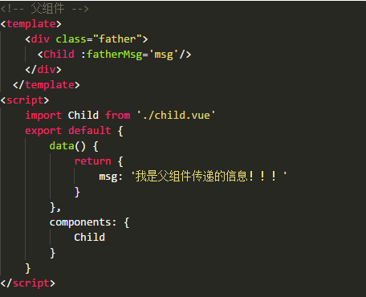<br/>
            > 接收：子转件通过vue实例化属性props接收父组件传递过来的数据，有两种接收的方式：<br/>
    <br/>
        > - 组件直接调用父组件，有两种调用，一是调用父组件$parent 二是调用根组件$root:<br/>
            > 父组件信息：<br/>
    <br/>
            > 在main.js里面定义的根组件：<br/>
    <br/>
            > 子组件获取信息：<br/>
    <br/>
    - 子组件 --> 父组件    
        > - 通过发送事件和监听事件实现
            > 发送事件（触发事件）：this.$emit(事件名，参数)；<br/>
    <br/>
            > 监听事件（事件响应）：<br/>
    <br/>
        > - 父组件直接获取子组件属性和方法<br/>
            > 我们可以给子组件起个名字。将名字设置为子组件ref属性的值；<br/>
    <br/>
            
    > 以上都是直接父子组件的传递数据的方法；
* 全局事件总线，用来处理兄弟，祖父祖孙组件之间的通信。
    > 方法就是使用一个空的vue实例（Bus）作为全局事件总线；
    <br/>
    >各组件可自己定义好组件内接收外部组件的消息事件即可，不用理会是哪个组件发过来；而对于发送事件的组件，亦不用理会这个事件到底怎么发送给我需要发送的组件。
    > - 定义一个空的vue实例；<br/>
    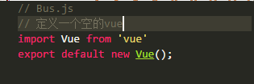<br/>
    > - 在需要用到的地方引入Bus.js；<br/>
        > 监听自定义事件<br/>
    <br/>
    > - 触发自定义事件<br/>
    <br/>


### Vuex的使用
>假设已经用vue脚手架工具构建好了项目；那么可以开始使用去引入vuex并使用它；
* 利用包管理器npm安装vuex <br/>
    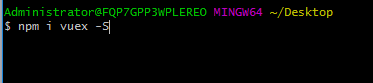<br/>
* 新建一个store.js，这个文件里面将用来存储各个组件传递的数据还有操作数据的方法；<br/>
    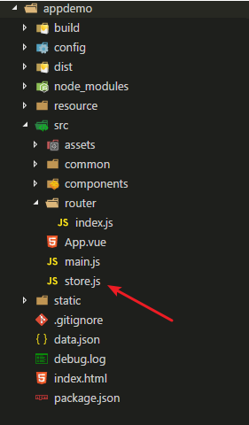<br/>
* 在store.js中输出vuex.Store对象的实例化；<br/>
    <br/>
* 之后我们在main.js中引入并且配置好我们要使用的vuex；<br/>
    <br/>
* 接下来就可以开始使用vuex了，vuex有5个核心概念分别是State，Getter，Mutation，Action，Module；
    - A.State：<br/>
        > Vuex这个属性将会存储着各个组件可能都会用到的数据；就好像localStorage，存储的是各个页面的共享数据；<br/>
        - <br/>
        > 在组件中我们可以通过this.$store.state.[数据名称]来显示这里面的数据，也可以写到computed计算属性里面：<br/>
        - <br/>
        还可以通过mapState的使用更加简单来取到state里面的数据：<br/>
        - 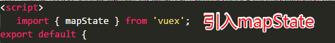<br/>
        然后只需要在计算属性里面加入：<br/>
        - <br/>
    - Mutations：<br/>
        > Mutations意思是改变的意思，我们在操作state里面的数据的时候可以简单的使用$store.state =另外的数据；这种方法也可以达到更新页面的效果，但是vuex为我们提供更规范的写法来操作state
        - <br/>
        > 之后我们是在组件上通过this.$store.commit(‘mutations里面的方法名称’)来触发相应的函数来达到更新state的目的；<br/>
        > 因为每次写this.$store.commit很浪费时间，所以vuex也提供对应的方法：mapMutations;<br/>
        - <br/>
    - Getters:<br/>
        > Getters意思是获取的意思，在vuex中的作用是在获取数据之前对数据进行加工处理后输出。<br/>
        > 基本用法：<br/>
        - 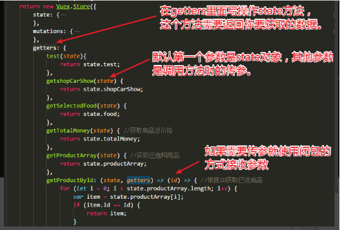<br/>
        - 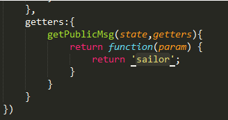<br/>
        > 之后可以在页面上通过this.$store.getters.方法名；如果需要传参就需要this.$store.getters.方法名(参数)；<br/>
        > Getters也是有对应的mapGetters方法来简化代码：<br/>
        - <br/>
    - Actions:<br/>
        > Actions和Mutations功能基本是一样的，但是actions是异步的改变state状态，而mutations是同步的改变状态。就是说当mutations里面的方法很复杂，执行时间久的话是会阻塞程序的运行，而actions是异步的所以就不会；<br/>
        > Actions操作的是mutation，而出发action则通过this.$store.dispatch(‘方法名’)来调用；<br/>
        - <br/>
        > 通过mapActions来简化代码：<br/>
        - 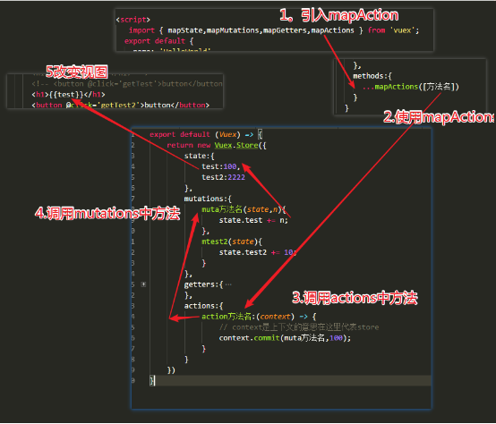<br/>
    - Module:<br/>
        > Module是模块的意思，当我们的项目很大很复杂的时候，state中存储的状态也会变得非常多；<br/>
        > 使用方法：
        - 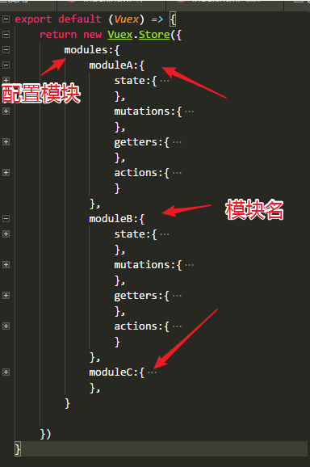<br/>
        > 配置完后，其他所说的操作数据的方法都要加上模块名称：
        - 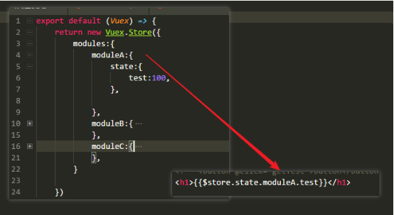<br/>
> 以上就是vuex的内容！！
        